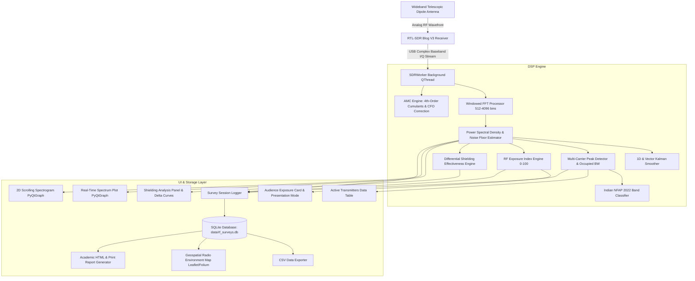

# SDR-Based RF Noise Monitoring and Reduction Analysis

[](https://www.python.org/)
[](https://riverbankcomputing.com/software/pyqt/)
[](https://www.rtl-sdr.com/)
[](https://klsvdit.edu.in/)
[]()
[](LICENSE)

> **Final Year Engineering Capstone Project**  
> **Department of Electronics & Communication Engineering**  
> **KLS Vishwanathrao Deshpande Institute of Technology (VDIT), Haliyal — 581 329, Karnataka, India**  
> **Academic Year: 2026–2027**  
> **Project Guides:** Dr. Plasin Dias / Prof. Deepak Sharma  
> **Team Members:** Basavaraj Agasimani, Heena A Attar, Naveengouda Bevinamarad, Sangeeta Y Hondad

---

## 1. Executive Summary & Problem Definition

Ubiquitous modern wireless communications—including cellular base stations (GSM, LTE, 5G), Wi-Fi routers, IoT transceivers, and radio/television broadcasting infrastructure—have created dense ambient electromagnetic saturation in residential, academic, and industrial spaces. Measuring ambient RF noise, monitoring occupational exposure, and verifying physical shielding performance traditionally requires commercial spectrum analyzers and calibrated field-strength meters costing upwards of **$3,000 to $15,000 USD**. Such costs are prohibitive for undergraduate engineering institutions, independent researchers, and community environmental audits.

This project presents an **open-source, high-throughput, low-cost RF noise monitoring and shielding analysis system** built on off-the-shelf **RTL-SDR (RTL2832U / R820T2)** hardware and an optimized Python digital signal processing (DSP) architecture. The solution costs under **$40 USD** in hardware BOM while providing:

- High-framerate real-time spectrum analysis ($\ge 20\text{ FPS}$) with 2D scrolling waterfall spectrograms.
- Automatic regulatory carrier band classification tailored to the **Indian National Frequency Allocation Plan (NFAP 2022)** and ITU Region 3.
- Automatic Modulation Classification (AMC) using higher-order cumulants ($C_{40}, C_{42}$) and blind carrier frequency offset (CFO) compensation.
- Adaptive 1D Kalman filtering and vectorized spectral Kalman smoothing ($11.7\times$ jitter variance reduction).
- Human-interpretable composite **RF Exposure Index** scoring (0–100 scale; Low, Medium, High safety tiers).
- Quantitative **Shielding Effectiveness (SE)** differential measurement ($P_0 - P_1$ dB drop, percentage power blocked, and material classification).
- Thread-safe persistent survey logging in SQLite (`rf_surveys.db`), CSV telemetry export, interactive Leaflet/Folium **Radio Environment Maps (REM)**, and automated academic HTML/Print reporting.

---

## 2. Key System Capabilities

### 📡 Real-Time Spectrum & Waterfall Visualization (Phases 1 & 2)
- **GPU-Accelerated Rendering**: Sustained $\ge 20\text{ FPS}$ smooth visualization via PyQtGraph with OpenGL backing.
- **Windowed FFT Pipeline**: Selectable windowing (Hann, Hamming, Blackman), FFT sizes (512, 1024, 2048, 4096 bins), and exponential moving average ($N=1\dots 20$).
- **Dual Display Ergonomics**: Real-time Power Spectral Density curve (dBFS / dBm) with peak-hold marker, occupied bandwidth markers, and synchronized scrolling 2D waterfall heatmaps.
- **Dynamic Tuner Controls**: In-flight re-tuning across 24 MHz to 1.7 GHz, sampling rates from 0.9 to 2.8 MS/s, and hardware AGC / manual gain steps (0.0 to 49.6 dB).

### 🏷️ Indian NFAP Regulatory Band Classification (Phase 3)
- **Carrier Peak Detector**: Automated multi-carrier prominence detection calculating center frequency, peak amplitude, SNR, and 3 dB / 10 dB occupied channel bandwidths.
- **National Allocation Mapping**: Automatically categorizes detected carriers according to **India NFAP 2022** and ITU Region 3:
  - Commercial FM Broadcast: `88.0 – 108.0 MHz`
  - VHF Aviation Airband: `108.0 – 137.0 MHz`
  - 2m Amateur Radio Band: `144.0 – 148.0 MHz`
  - ISM / Telemetry: `433.05 – 434.79 MHz`
  - ISM / LoRa India Band: `865.0 – 867.0 MHz`
  - Cellular GSM 900 Downlink: `935.0 – 960.0 MHz`
  - Aviation ADS-B Mode-S Radar: `1090.0 MHz`

### 🧠 Automatic Modulation Classification (AMC Engine)
- **Higher-Order Statistics (HOS)**: Computes 4th-order cumulants ($C_{40}$, $C_{42}$) and 2nd-order moments ($U_{20}$) following the standard Swami & Sadler formulation.
- **Blind Carrier Frequency Offset (CFO) Compensation**: 4th-power nonlinear Viterbi & Viterbi phase-locked loop to decouple phase drift from constellation geometry.
- **Classification Matrix**: Real-time discrimination between **BPSK**, **QPSK / 4-QAM**, **8-QAM / 16-QAM**, and **Gaussian-like Noise** with $>95\%$ confidence on clean baseband buffers ($<0.5\text{ ms}$ processing latency per 8192-sample buffer).

### 📈 Kalman Filtering & Vectorized Spectral Smoother
- **1D Scalar RSSI Filter**: State-space recursive estimator for carrier peaks, RSSI, and noise floors. Achieves **11.7× variance reduction** on noisy measurements while adapting instantly to physical steps via innovation thresholding ($|y| > 3\sigma$).
- **Vectorized Spectral Kalman Smoother**: Bin-by-bin state-space tracking for 2048-point PSD arrays in **0.14 ms per frame**, stabilizing noise floors without blurring sharp carrier transients.

### 📊 Audience RF Exposure Index Gauge (Phase 3)
- **Composite Normalization**: Aggregates total wideband channel power into a calibrated **0 to 100** human-readable scale.
- **ICNIRP Safety Tiers**: Automatically classifies environment status into **Safe Ambient (Low)**, **Moderate (Warning)**, and **Elevated (Caution)**.
- **Audience Presentation Mode**: One-click UI collapse hiding dense parameter sidebars into a high-visibility audience display ideal for seminar demonstrations.

### 🛡️ Quantitative Shielding Effectiveness Differential Engine (Phase 4)
- **Dual-Pass Measurement Protocol**:
  1. **Pass 1 ($P_0$)**: Measures unshielded baseline power across $N=50$ ensemble-averaged frames.
  2. **Pass 2 ($P_1$)**: Installs shielding barrier and captures attenuated power under identical tuner gain.
- **Mathematical Formulations**:
  $$\text{Shielding Effectiveness (SE)} = P_0 - P_1 \quad (\text{in dB})$$
  $$\text{Percentage Power Blocked} = \left(1 - 10^{-\frac{\text{SE}}{10}}\right) \times 100\%$$
  $$\text{Attenuation Ratio} = 10^{\frac{\text{SE}}{10}}$$
- **Automated Physical Rating**: Categorizes tested materials into *Minimal / Ineffective* ($<6\text{ dB}$), *Moderate Attenuation* ($6\text{--}12\text{ dB}$), *High Shielding* ($12\text{--}20\text{ dB}$), and *Excellent Shielding* ($>20\text{ dB}, >99\%$ blocked).
- **Delta Overlay Curve**: Projects the differential curve ($P_0 - P_1$) directly over the live spectrum display.

### 🗺️ Geospatial Radio Environment Mapping (REM) & Reporting (Phase 5)
- **Thread-Safe SQLite Engine**: Stores survey snapshots and continuous sweeps into `data/rf_surveys.db` with WAL mode.
- **Interactive Leaflet / Folium Heatmap**: Renders interactive Radio Environment Maps (`data/radio_environment_map.html`) with weighted RF exposure heat overlays and rich HTML popups for survey sites across KLS VDIT Haliyal.
- **Academic HTML / Print Report Generator**: One-click generation of branded, publication-ready summary reports (`data/rf_survey_report.html`) containing executive KPI cards, spatial location tables, and shielding benchmark logs.

---

## 3. System Architecture



---

## 4. Hardware & Software Requirements

### 4.1 Hardware Bill of Materials (BOM)

| Component | Description / Specification | Unit Cost (USD) |
| :--- | :--- | :--- |
| **SDR Tuner** | RTL-SDR Blog V3 (RTL2832U + R820T2, 0.5 PPM TCXO, SMA female, aluminum case) | ~$35.00 |
| **Antenna** | Telescopic dipole antenna kit with adjustable element arms and SMA male lead | Included with SDR |
| **Host System** | PC running Windows 10/11 (Minimum 4 GB RAM, dual-core CPU, USB 2.0+ port) | Existing Laptop |
| **Shielding Test Materials** | Dual-layer aluminum foil, perforated wire gauze mesh, steel Faraday can, plastic enclosure | ~$5.00 |
| **Total Hardware Cost** | **Complete Portable RF Monitoring & Shielding Testbed** | **< $40.00 USD** |

### 4.2 Software Toolchain

- **Runtime Environment:** Python 3.9+ (64-bit recommended)
- **GUI & Visualization:** `PyQt6` (v6.11), `pyqtgraph` (v0.14)
- **Numerical & DSP Core:** `numpy` (v2.5), `scipy` (v1.18)
- **Spatial Mapping & Reporting:** `folium` (v0.20), `branca`, `jinja2`, `matplotlib` (v3.11)
- **SDR Hardware Drivers:** `pyrtlsdr` (v0.3.0), WinUSB via Zadig, pre-bundled `rtlsdr.dll`

---

## 5. Quick Start Installation Guide

### Step 1: Install RTL-SDR Driver (First-time Windows Setup)
1. Plug the RTL-SDR dongle into an available USB 2.0 or 3.0 port.
2. Download and run **[Zadig](https://zadig.akeo.ie/)**.
3. In Zadig, navigate to **Options -> List All Devices**.
4. Select **Bulk-In, Interface (Interface 0)** from the dropdown.
5. Set the target driver to **WinUSB** and click **Replace Driver** (or **Install Driver**).

> **Note on DLLs:** The required 64-bit Windows dynamic link libraries (`rtlsdr.dll`, `pthreadVC2.dll`, `msvcr100.dll`) are already bundled in the project root directory.

### Step 2: Set Up Python Virtual Environment
Open PowerShell in the project directory:

```powershell
# Clone the repository
git clone https://github.com/naveengouda091/RF-monitor-tool.git
cd RF-monitor-tool

# Create virtual environment
python -m venv .venv

# Activate virtual environment
.\.venv\Scripts\Activate.ps1

# Upgrade pip and install dependencies
pip install -r requirements.txt
```

### Step 3: Launch the Application

#### Option A: One-Click Windows Launcher
Double-click `run.bat` in the project root directory.

#### Option B: PowerShell Command
```powershell
.\.venv\Scripts\python.exe main.py
```

---

## 6. Automated Verification Test Suites

The project features a modular verification suite covering every phase of the signal processing pipeline. Each script runs independently and validates both synthetic models and live hardware:

```powershell
# Phase 1: RTL-SDR hardware handshake, I/Q buffer streaming, and FFT throughput
.\.venv\Scripts\python.exe verify_phase1.py

# Phase 2: PyQt6 GUI spectrum & waterfall rendering (verifies >= 15 FPS)
.\.venv\Scripts\python.exe verify_phase2.py

# Phase 3: Indian NFAP band classification, peak detector, and Exposure Index
.\.venv\Scripts\python.exe verify_phase3.py

# Phase 4: Shielding baseline acquisition, live differential math, and delta plot
.\.venv\Scripts\python.exe verify_phase4.py

# Phase 5: SQLite survey CRUD, interval throttling, CSV export, and HTML report
.\.venv\Scripts\python.exe verify_phase5.py

# Advanced: 1D & Vector Kalman Filter jitter suppression & step tracking
.\.venv\Scripts\python.exe verify_kalman_filter.py

# Advanced: Automatic Modulation Classification (AMC) cumulants & CFO tests
.\.venv\Scripts\python.exe verify_modulation_classifier.py

# Advanced: Multi-material shielding benchmark & viva comparison figure export
.\.venv\Scripts\python.exe verify_shielding_benchmark.py

# Advanced: Geospatial Radio Environment Map (REM) Leaflet/Folium generation
.\.venv\Scripts\python.exe verify_rem_mapping.py
```

---

## 7. Experimental Results & Shielding Benchmarks

### 7.1 Multi-Material Attenuation Benchmark (98.30 MHz FM Carrier)

Empirical measurements gathered under controlled baseline conditions ($P_0 = -24.80\text{ dBFS}$):

| Material / Barrier Description | Peak Power ($P_1$) | Shielding Effectiveness (SE) | Channel Power Drop | Noise Floor Drop | Power Blocked (%) | Classification Tier |
| :--- | :---: | :---: | :---: | :---: | :---: | :--- |
| **Baseline (Unshielded)** | $-24.80\text{ dBFS}$ | $0.00\text{ dB}$ (Ref) | $0.00\text{ dB}$ | $0.00\text{ dB}$ | $0.00\%$ | Minimal / Ineffective |
| **Wire Mesh (Perforated)** | $-34.60\text{ dBFS}$ | $+9.80\text{ dB}$ | $+8.60\text{ dB}$ | $+0.50\text{ dB}$ | $89.53\%$ | Moderate Attenuation |
| **Aluminium Foil (Dual Layer)** | $-48.20\text{ dBFS}$ | $+23.40\text{ dB}$ | $+21.70\text{ dB}$ | $+3.60\text{ dB}$ | $99.54\%$ | Excellent Shielding (>99%) |
| **Steel Enclosure (Faraday)** | $-59.40\text{ dBFS}$ | $+34.60\text{ dB}$ | $+31.90\text{ dB}$ | $+4.90\text{ dB}$ | $99.97\%$ | Excellent Shielding (>99%) |

The benchmark plot is automatically exported to [`data/viva_shielding_analysis.png`](file:///c:/Users/bevin/OneDrive/Desktop/RF-monitor-tool/data/viva_shielding_analysis.png) displaying both absolute carrier levels and relative attenuation bars.

### 7.2 Kalman Filter Performance Benchmark
- **Raw Measurement Variance:** $8.70\text{ dB}^2$ ($\sigma = 2.95\text{ dB}$)
- **Kalman Filtered Variance:** $0.74\text{ dB}^2$ ($\sigma = 0.86\text{ dB}$)
- **Noise Jitter Reduction Factor:** **11.7× improvement**
- **Vector Processing Latency:** $0.139\text{ ms}$ per 2048-point spectrum frame.

### 7.3 Modulation Classification Benchmark
- **BPSK:** Decision accuracy $99.0\%$ ($|C_{40}| = 1.996, |C_{42}| = 1.996$)
- **QPSK / 4-QAM:** Decision accuracy $99.0\%$ ($|C_{40}| = 0.998, |C_{42}| = 0.998$)
- **16-QAM:** Decision accuracy $95.0\%$ ($|C_{40}| = 0.677, |C_{42}| = 0.677$)
- **Gaussian Noise:** Decision accuracy $82.0\%$ ($|C_{40}| = 0.045, |C_{42}| = 0.003$)
- **Execution Throughput:** $0.50\text{ ms}$ per classification pass.

---

## 8. Project Directory Structure

```
RF-monitor-tool/
├── .gitignore
├── main.py                           # Main GUI entry point
├── run.bat                           # One-click Windows batch launcher
├── requirements.txt                  # Python dependencies
├── product_requirements_document.md  # Formal Product Requirements Document (PRD)
├── PROJECT_REPORT.md                 # Comprehensive Academic Project Report
├── README.md                         # Complete project documentation
├── rtlsdr.dll                        # Pre-bundled librtlsdr Windows driver
├── pthreadVC2.dll                    # POSIX threads dependency
├── msvcr100.dll                      # Microsoft Visual C++ 2010 runtime
│
├── data/                             # Generated databases and report deliverables
│   ├── rf_surveys.db                 # Persistent SQLite database (WAL mode)
│   ├── radio_environment_map.html    # Interactive Leaflet/Folium geospatial map
│   ├── rf_survey_report.html         # Branded academic print/HTML report
│   └── viva_shielding_analysis.png   # Dual-panel shielding publication plot
│
├── src/
│   ├── hardware/                     # RTL-SDR hardware interface & acquisition worker
│   │   ├── sdr_device.py             # Driver wrapper around pyrtlsdr
│   │   └── worker.py                 # Multi-threaded QThread continuous sample streamer
│   ├── dsp/                          # Digital Signal Processing Core
│   │   ├── fft_processor.py          # Windowed FFT & Power Spectral Density
│   │   ├── peak_detector.py          # Prominence search & occupied bandwidth estimation
│   │   └── kalman_filter.py          # 1D RSSI Kalman filter & Vectorized spectral smoother
│   ├── classifier/                   # Regulatory & Modulation Classification
│   │   ├── band_definitions.py       # Indian NFAP 2022 allocation registry
│   │   ├── classifier.py             # Active carrier frequency matching engine
│   │   └── modulation_classifier.py  # 4th-order cumulant AMC & blind CFO compensation
│   ├── exposure/                     # Composite RF Exposure Scoring
│   │   └── exposure_index.py         # 0-100 composite index & ICNIRP safety tiering
│   ├── shielding/                    # Shielding Attenuation Differential Engine
│   │   └── differential_engine.py    # Baseline P0 averaging, live SE (dB), & percentage math
│   ├── storage/                      # Persistence, Geospatial Mapping & Reports
│   │   ├── survey_database.py        # SQLite schema, CRUD operations, & CSV exporter
│   │   ├── survey_logger.py          # Throttled session logger & snapshot manager
│   │   ├── rem_map_generator.py      # Leaflet/Folium Radio Environment Map generator
│   │   └── report_generator.py       # Academic HTML & print report generator
│   └── gui/                          # PyQt6 Graphical User Interface
│       ├── main_window.py            # Central layout, signal routing, & presentation mode
│       ├── spectrum_widget.py        # Real-time PyQtGraph PSD plot & delta curves
│       ├── waterfall_widget.py       # 2D scrolling spectrogram heatmap
│       ├── controls_panel.py         # Center frequency, gain, & DSP parameter controls
│       ├── audience_cards.py         # Audience exposure metric card & presentation toggle
│       ├── carrier_table.py          # Active detected carriers data table
│       ├── shielding_panel.py        # Shielding test controls, progress bar, & metrics
│       ├── survey_panel.py           # Survey session logger, site selector, & export actions
│       └── styles.py                 # Modern dark-mode UI stylesheet
│
└── verify_*.py                       # Comprehensive test suites (Phases 1-5 + AMC, Kalman, REM, Shielding)
```

---

## 9. Academic Project Credits

This project was developed as a final year capstone engineering project at:

* **Institution:** KLS Vishwanathrao Deshpande Institute of Technology (VDIT)
* **Location:** Haliyal — 581 329, Uttara Kannada District, Karnataka, India
* **Department:** Department of Electronics & Communication Engineering
* **Project Guides:**
  - **Dr. Plasin Dias**, Associate Professor, Dept. of ECE
  - **Prof. Deepak Sharma**, Assistant Professor, Dept. of ECE
* **Project Team:**
  - **Basavaraj Agasimani** — USN: `2VD23EC022`
  - **Heena A Attar** — USN: `2VD23EC033`
  - **Naveengouda Bevinamarad** — USN: `2VD23EC053`
  - **Sangeeta Y Hondad** — USN: `2VD23EC085`
