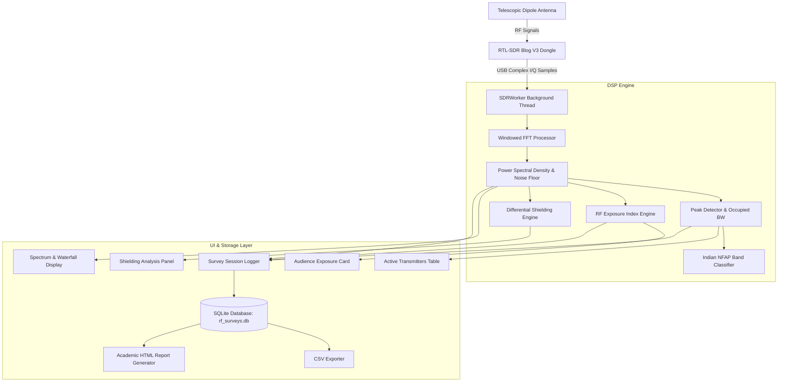

# SDR-Based RF Noise Monitoring and Reduction Analysis

[](https://www.python.org/)
[](https://riverbankcomputing.com/software/pyqt/)
[](https://www.rtl-sdr.com/)
[](https://klsvdit.edu.in/)
[]()

> **Final Year Engineering Capstone Project**  
> **Department of Electronics & Communication Engineering**  
> **KLS Vishwanathrao Deshpande Institute of Technology (VDIT), Haliyal — 581 329**  
> **Academic Year: 2026–2027**

---

## 1. Overview & Problem Definition

Ubiquitous wireless infrastructure—such as cellular base stations (GSM/LTE/5G), Wi-Fi routers, IoT transmitters, and broadcast radio/TV—has dramatically increased ambient radio frequency (RF) saturation. Measuring ambient RF noise and verifying physical shielding effectiveness typically requires commercial spectrum analyzers costing upwards of \$3,000 to \$10,000, which is prohibitive for classrooms, research laboratories, and distributed environmental surveys.

This project delivers an **open-source, high-performance, cost-effective RF monitoring and shielding analysis system** using an off-the-shelf **RTL-SDR dongle** and modern digital signal processing (DSP). The software provides real-time spectrum analysis ($\ge 20\text{ FPS}$), automatic signal classification based on the **Indian National Frequency Allocation Plan (NFAP)**, composite **RF Exposure Index** scoring, live **Shielding Effectiveness (SE)** differential measurement, spatial SQLite database logging, and automated academic report generation.

---

## 2. Key Features

### 📡 Real-Time Spectrum & Waterfall Visualization (Phase 1 & 2)
- **High Frame Rate**: Sustained $\ge 20\text{ FPS}$ rendering using hardware-accelerated PyQtGraph.
- **Windowed FFT Processing**: Selectable FFT sizes (512, 1024, 2048, 4096 bins), window functions (Hann, Hamming, Blackman), and exponential moving averaging ($N=1\dots 20$).
- **Dual Display**: Live PSD curve ($\text{dBFS} / \text{dBm}$) with peak hold marker and scrolling 2D waterfall spectrogram.
- **Dynamic Controls**: In-flight tuning of center frequency (24 MHz – 1.7 GHz), sampling rate (0.9 – 2.8 MS/s), and tuner gain steps (0.0 – 49.6 dB or hardware AGC).

### 🏷️ Indian NFAP Band Classifier & Peak Detection (Phase 3)
- **Peak Identification**: Multi-carrier peak detector estimating signal power, signal-to-noise ratio (SNR), and 3 dB / 10 dB occupied channel bandwidths.
- **National Allocation Mapping**: Automatically classifies active carriers according to **India NFAP 2022** and ITU Region 3 bands:
  - Commercial FM Broadcast (88.0 – 108.0 MHz)
  - VHF Aviation Airband (108.0 – 137.0 MHz)
  - 2m Amateur VHF Band (144.0 – 148.0 MHz)
  - ISM / Telemetry (433.05 – 434.79 MHz)
  - ISM / LoRa India (865.0 – 867.0 MHz)
  - Cellular GSM 900 Downlink (935.0 – 960.0 MHz)
  - Aviation ADS-B Flight Radar (1090.0 MHz)

### 📊 Audience RF Exposure Index Gauge (Phase 3)
- **Composite Scoring**: Normalizes wideband channel power into an intuitive **0 to 100** scale.
- **Safety Tiers**: Categorized into **Low (Safe Ambient)**, **Medium (Moderate)**, and **High (Elevated)** exposure tiers.
- **Audience Presentation Mode**: One-click toggle that collapses complex technical sidebars into an easy-to-read audience display.

### 🛡️ Live Shielding Attenuation Differential Analyzer (Phase 4)
- **Dual-Pass Workflow**: 
  1. Capture $P_0$ (Unshielded reference baseline across $N$ averaged frames).
  2. Measure live $P_1$ with shielding enclosure installed.
- **Quantitative Metrics**:
  $$\text{Shielding Effectiveness (SE)} = P_0 - P_1 \quad (\text{in dB})$$
  $$\text{Percentage Power Blocked} = \left(1 - 10^{-\frac{\text{SE}}{10}}\right) \times 100\%$$
  $$\text{Attenuation Ratio} = 10^{\frac{\text{SE}}{10}}$$
- **Automated Material Tiers**: Classifies effectiveness from *Minimal / Ineffective* ($<6\text{ dB}$) up to *Excellent Shielding* ($>20\text{ dB}$, $>99\%$ blocked).
- **Differential Plot**: Visualizes the delta curve ($P_0 - P_1$) overlaid directly on the frequency spectrum.

### 💾 Persistent Survey Logging & Report Generation (Phase 5)
- **Spatial SQLite Database**: Thread-safe storage with WAL mode (`rf_surveys.db`) logging timestamps, location tags, frequency spans, peak powers, dominant bands, and exposure tiers.
- **Flexible Survey Session**: Supports both continuous interval-throttled recording (1.0s – 10.0s) and instant manual snapshots.
- **Data Export & Reporting**:
  - Direct export of survey and shielding benchmark logs to standard `.csv`.
  - Comprehensive, print-ready academic **HTML report generator** branded for KLS VDIT Haliyal with spatial statistics and tables.

---

## 3. System Architecture



---

## 4. Hardware Requirements

| Component | Specification |
| :--- | :--- |
| **SDR Receiver** | RTL2832U-based tuner (RTL-SDR Blog V3 or V4 recommended, R820T / R820T2) |
| **Antenna** | Telescopic dipole antenna with SMA connector |
| **Host System** | PC running Windows 10/11 (Minimum 4 GB RAM, multi-core CPU, USB 2.0+ port) |
| **Test Shields** | Multi-layer aluminum foil, copper wire mesh, conductive fabrics, metal enclosures, plastic |

---

## 5. Quick Start Guide

### Step 1: Install Drivers (First-time Windows Setup)
1. Plug in your RTL-SDR dongle to a USB 2.0/3.0 port.
2. Download and launch **[Zadig](https://zadig.akeo.ie/)**.
3. In Zadig, select **Options -> List All Devices**.
4. Choose **Bulk-In, Interface (Interface 0)**.
5. Set the target driver to **WinUSB** and click **Replace Driver**.

### Step 2: Set Up Python Environment
Clone the repository and set up a virtual environment:

```powershell
# Clone the repository
git clone https://github.com/naveengouda091/RF-monitor-tool.git
cd RF-monitor-tool

# Create and activate virtual environment
python -m venv .venv
.\.venv\Scripts\Activate.ps1

# Install dependencies
pip install -r requirements.txt
```

> **Note:** Required Windows runtime DLLs (`rtlsdr.dll`, `pthreadVC2.dll`, `msvcr100.dll`) are already bundled in the project root directory.

### Step 3: Run Application

#### Option A: One-Click Launcher (Windows)
Double-click `run.bat` in the project root folder.

#### Option B: Terminal Command
```powershell
python main.py
```

---

## 6. Verification Test Suites

Each phase includes an automated end-to-end verification test suite that benchmarks functionality against live connected hardware:

```powershell
# Phase 1: RTL-SDR connection, I/Q buffer capture & FFT performance
python verify_phase1.py

# Phase 2: PyQt6 GUI spectrum & waterfall streaming (target >= 15 FPS)
python verify_phase2.py

# Phase 3: NFAP classifier, peak detection, and exposure score
python verify_phase3.py

# Phase 4: Shielding baseline capture, live SE calculation & delta curves
python verify_phase4.py

# Phase 5: SQLite CRUD, interval throttling, CSV export & HTML report
python verify_phase5.py
```

All 5 test suites pass with a sustained GUI rendering rate of **20–24 FPS** on standard PC hardware.

---

## 7. Project Directory Structure

```
RF-monitor-tool/
├── .gitignore
├── main.py                     # Main application entry point
├── run.bat                     # Windows one-click batch launcher
├── requirements.txt            # Python dependencies
├── product_requirements_document.md
├── README.md                   # Project documentation
├── rtlsdr.dll                  # Bundled librtlsdr Windows driver DLL
├── pthreadVC2.dll              # POSIX threads dependency
├── msvcr100.dll                # VC runtime dependency
│
├── data/                       # Local database directory (ignored by git)
│   └── rf_surveys.db           # SQLite survey & shielding database
│
├── src/
│   ├── hardware/               # SDR driver and background acquisition worker
│   │   ├── sdr_device.py       # Wrapper around pyrtlsdr
│   │   └── worker.py           # Threaded QThread sample streaming & DSP dispatch
│   ├── dsp/                    # Digital Signal Processing modules
│   │   ├── fft_processor.py    # Windowed FFT & Power Spectral Density
│   │   └── peak_detector.py    # Peak search & 3dB/10dB occupied bandwidth
│   ├── classifier/             # Regulatory band classification
│   │   ├── band_definitions.py # Indian NFAP 2022 frequency definitions
│   │   └── classifier.py       # Multi-carrier classification engine
│   ├── exposure/               # Exposure Index scoring
│   │   └── exposure_index.py   # Normalized composite metric & safety tiers
│   ├── shielding/              # Shielding effectiveness differential analyzer
│   │   └── differential_engine.py # Baseline acquisition & SE math
│   ├── storage/                # Survey database & reporting
│   │   ├── survey_database.py  # SQLite CRUD, stats, & CSV exporter
│   │   ├── survey_logger.py    # Throttled session logger & snapshot manager
│   │   └── report_generator.py # Academic HTML & print report generator
│   └── gui/                    # PyQt6 graphical interface
│       ├── main_window.py      # Main window & layout coordination
│       ├── spectrum_widget.py  # Real-time power spectrum plot (PyQtGraph)
│       ├── waterfall_widget.py # 2D scrolling waterfall plot (PyQtGraph)
│       ├── controls_panel.py   # Tuner frequency, gain, & DSP controls
│       ├── audience_cards.py   # Audience exposure metric ribbon & presentation mode
│       ├── carrier_table.py    # Active transmitters table
│       ├── shielding_panel.py  # Shielding evaluation controls & metrics
│       ├── survey_panel.py     # Survey session, site selector, & export actions
│       └── styles.py           # Dark theme design system stylesheet
│
└── verify_phase*.py            # Automated test suites for Phases 1 through 5
```

---

## 8. Academic Project Team

* **Department:** Electronics & Communication Engineering
* **Institution:** KLS Vishwanathrao Deshpande Institute of Technology (VDIT), Haliyal, Karnataka, India
* **Project Guides:** Dr. Plasin Dias / Prof. Deepak Sharma
* **Project Team Members:**
  - **Basavaraj Agasimani** (USN: 2VD23EC022)
  - **Heena A Attar** (USN: 2VD23EC033)
  - **Naveengouda Bevinamarad** (USN: 2VD23EC053)
  - **Sangeeta Y Hondad** (USN: 2VD23EC085)
